  <!-- ==================== HERO: EMMI ACASCI TERMINAL BANNER ==================== -->
  <picture>
    <source media="(prefers-color-scheme: dark)" srcset="assets/banner-dark.v1.svg">
    <source media="(prefers-color-scheme: light)" srcset="assets/banner-light.v1.svg">
    
  </picture>

  <!-- Dynamic Typing Subheader -->
  

    
  

  <!-- Status Badges -->
  

    
    
    
    
  

---

### ⚡ `whoami --verbose`

<table>
  <tr>
    <td width="290" align="center" valign="middle">
      
       
      <b>DELIGHT CHUKWUBUIHEM</b> <i>Founder &amp; Chief Systems Architect</i>
    </td>
    <td valign="top">
      <h4><code>System.Profile.Identity</code></h4>
      

        I am a <b>Founder</b>, <b>Chief Systems Architect</b>, and <b>Agentic Engineer</b> specialized in designing autonomous software architectures, resilient cloud infrastructures, and high-performance native &amp; web applications.
      

      <ul>
        <li>🧬 <b>Founder &amp; CEO</b> at <b>Auscera Tech Ltd</b> — Pioneering autonomous agent engines, distributed workflow fabrics, and intelligent systems.</li>
        <li>🤖 <b>Autonomous Agent Operating Systems</b> — Creator of <b>Agent OS</b> &amp; <b>BWA</b> (Building With AI) framework: declarative memory graphs, self-healing tool routing, and reactive multi-agent execution loops.</li>
        <li>⚡ <b>Production Systems</b> — High-throughput event streams, low-latency native micro-utilities (Tauri/Rust), quantitative trading engines, and full-stack cloud ecosystems.</li>
        <li>🌐 <b>Engineering Philosophy</b>: <i>"Don't just write code — architect autonomous systems that operate, heal, and scale themselves."</i></li>
      </ul>
      

        <b>Core Disciplines</b>: <code>Autonomous Agents</code> • <code>Distributed Systems</code> • <code>Full-Stack Web &amp; Mobile</code> • <code>WebGL / 3D Graphics</code> • <code>FinTech</code>
      

    </td>
  </tr>
</table>

---

### 🛠️ `toolbox --inspect-all`

#### **Languages &amp; Runtimes**

  

#### **Frontend, Mobile &amp; Graphics Engines**

  

#### **Backend, Systems &amp; Runtimes**

  

#### **Cloud, Database, CI/CD &amp; Infrastructure**

  

---

### 🌐 `telemetry --radar-competency`

  

---

### 🚀 `projects --flagships`

| Project | Domain / Type | Architecture &amp; Stack | GitHub / Access |
| :--- | :--- | :--- | :--- |
| **Agent OS** | Autonomous Agent OS | Multi-agent execution loop, self-healing memory system, dynamic tool discovery (`TypeScript`, `Node.js`, `Python`) | [Repository](https://github.com/delightc123/Agents-OS) |
| **BWA Framework** | AI Architecture | Declarative system prompts, agent governance rules, and memory lifecycle protocols | [Repository](https://github.com/delightc123/Agents-OS) |
| **Nexa** | Full-Stack Platform | High-concurrency modern web &amp; mobile application (`Next.js 15`, `React 19`, `TailwindCSS`, `PostgreSQL`) | [Repository](https://github.com/delightc123/nexa) |
| **Scaleo Capital** | Quantitative FinTech | Algorithmic trading analytics, real-time risk intelligence, and telemetry (`TypeScript`, `FastAPI`, `WebSockets`) | [Repository](https://github.com/delightc123/Scaleo-App) |
| **CleoNotch** | Native Desktop Utility | Ultra-lightweight macOS-style Dynamic Island notch companion for Windows (`Tauri 2`, `Rust`, `React`) | [Repository](https://github.com/delightc123/Cleonotch) |
| **CleoClip** | Systems Clipboard | Cross-platform clipboard synchronization utility with end-to-end encryption (`Tauri`, `Rust`, `TypeScript`) | [Repository](https://github.com/delightc123/cleoclip) |
| **COD** | Mission Control | Command On Demand: real-time execution orchestrator and live distributed task monitor | [Repository](https://github.com/delightc123/COD) |
| **Rivera** | Automation Engine | Enterprise workflow fabric, event-driven pipelines, and scheduled telemetry collectors | [Repository](https://github.com/delightc123/Rivera) |
| **Auscera** | Venture / Lab | Innovation laboratory &amp; parent technology enterprise for autonomous systems | [Auscera](https://github.com/delightc123) |

---

### 📈 `github.telemetry --metrics`

  <!-- Streak Stats -->
  
  <!-- Core Stats -->
  

 

  <!-- Top Languages -->
  

---

### 🎮 `github.contributions --snake`

  <picture>
    <source media="(prefers-color-scheme: dark)" srcset="https://raw.githubusercontent.com/delightc123/delightc123/output/github-contribution-grid-snake-dark.svg">
    <source media="(prefers-color-scheme: light)" srcset="https://raw.githubusercontent.com/delightc123/delightc123/output/github-contribution-grid-snake.svg">
    
  </picture>

---

### 🏆 `trophies --gamified-achievements`

  

---

### 📡 `connect --handshake`

  
  
  
  

    
  
    <code>SYSTEM_ID: AUSCERA-0x9F4B2</code> • 
    <code>KERNEL: BWA-v2.6</code> • 
    <code>BUILD: COMPILED_WITH_AI</code> • 
    <code>UPTIME: 99.98%</code>
  

