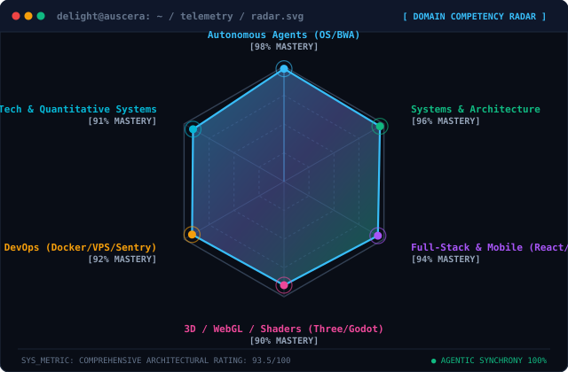
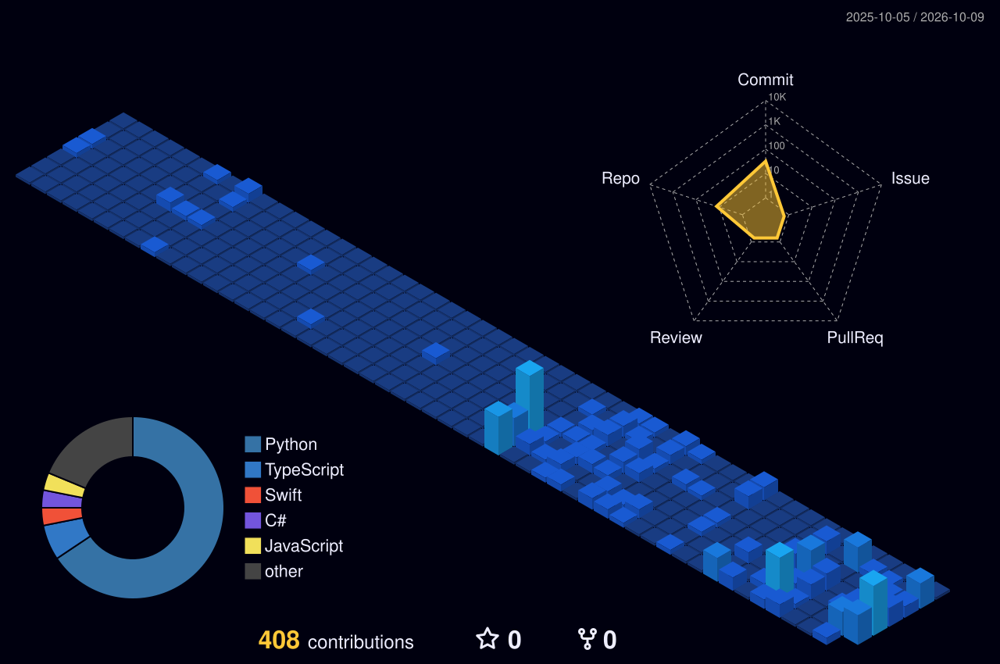

  <!-- ==================== HERO: CRYPTOGRAPHIC DECRYPT / ENCRYPT HERO ==================== -->
  

  <!-- Dynamic Typing Subheader -->
  

    
  

  <!-- Interactive Social & Status Badges -->
  

    
    
    
    
    
    
  

---

### Who I Am

I am Delight Chukwubuihem, a Creative Design and Systems Engineer, and the Founder and CEO of Auscera.

I work at the convergence of systems engineering, autonomous agent architectures, and intentional product design. My focus is on creating self-operating software, resilient backend fabrics, and high-performance native desktop tools.

* **Auscera**: Leading our technology studio focused on autonomous agent operating environments, distributed workflows, and intelligent software fabrics.
* **Agent OS and BWA Architecture**: Designing autonomous agent systems featuring declarative memory, dynamic tool routing, and self-healing execution loops.
* **Systems and Native Platforms**: Building low-latency native desktop applications with Tauri and Rust, real-time trading engines, and modern full-stack web applications.
* **Engineering Philosophy**: "Don't just write code, architect autonomous systems that operate, heal, and scale themselves."

**Focus Areas**: Autonomous Agent Systems, Distributed Systems, Full-Stack Web and Mobile, WebGL and 3D, Quantitative FinTech

---

### Technical Stack & Toolbox

#### **Languages &amp; Runtimes**

  

#### **Frontend, Mobile &amp; Graphics Engines**

  

#### **Backend, Systems &amp; Runtimes**

  

#### **Cloud, Database, CI/CD &amp; Infrastructure**

  

---

### Domain Competency

  

---

### 🚀 `projects --flagships`

| Project | Domain / Type | Architecture &amp; Stack | GitHub / Access |
| :--- | :--- | :--- | :--- |
| **Agent OS** | Autonomous Agent OS | Multi-agent execution loop, self-healing memory system, dynamic tool discovery (`TypeScript`, `Node.js`, `Python`) | [Repository](https://github.com/delightc123/Agents-OS) |
| **BWA Framework** | AI Architecture | Declarative system prompts, agent governance rules, and memory lifecycle protocols | [Repository](https://github.com/delightc123/Agents-OS) |
| **Nexa** | Full-Stack Platform | High-concurrency modern web &amp; mobile application (`Next.js 15`, `React 19`, `TailwindCSS`, `PostgreSQL`) | [Repository](https://github.com/delightc123/nexa) |
| **Scaleo Capital** | Quantitative FinTech | Algorithmic trading analytics, real-time risk intelligence, and telemetry (`TypeScript`, `FastAPI`, `WebSockets`) | [Repository](https://github.com/delightc123/Scaleo-App) |
| **CleoNotch** | Native Desktop Utility | Ultra-lightweight macOS-style Dynamic Island notch companion for Windows (`Tauri 2`, `Rust`, `React`) | [Repository](https://github.com/delightc123/Cleonotch) |
| **CleoClip** | Systems Clipboard | Cross-platform clipboard synchronization utility with end-to-end encryption (`Tauri`, `Rust`, `TypeScript`) | [Repository](https://github.com/delightc123/cleoclip) |
| **COD** | Mission Control | Command On Demand: real-time execution orchestrator and live distributed task monitor | [Repository](https://github.com/delightc123/COD) |
| **Rivera** | Automation Engine | Enterprise workflow fabric, event-driven pipelines, and scheduled telemetry collectors | [Repository](https://github.com/delightc123/Rivera) |
| **Auscera** | Venture / Lab | Innovation laboratory &amp; parent technology enterprise for autonomous systems | [Auscera](https://github.com/delightc123) |

---

### Activity & Contribution Timeline

  <picture>
    <source media="(prefers-color-scheme: dark)" srcset="profile-3d-contrib/profile-night-view.svg">
    <source media="(prefers-color-scheme: light)" srcset="profile-3d-contrib/profile-green-animate.svg">
    
  </picture>

---

### 🎮 `github.contributions --snake`

  <picture>
    <source media="(prefers-color-scheme: dark)" srcset="https://raw.githubusercontent.com/delightc123/delightc123/output/github-contribution-grid-snake-dark.svg">
    <source media="(prefers-color-scheme: light)" srcset="https://raw.githubusercontent.com/delightc123/delightc123/output/github-contribution-grid-snake.svg">
    
  </picture>

---

### 📡 `connect --handshake`

  
  
  
  
  
  

    
  
    <code>SYSTEM_ID: AUSCERA-0x9F4B2</code> • 
    <code>KERNEL: BWA-v2.6</code> • 
    <code>BUILD: COMPILED_WITH_AI</code> • 
    <code>UPTIME: 99.98%</code>
  

